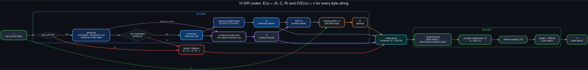
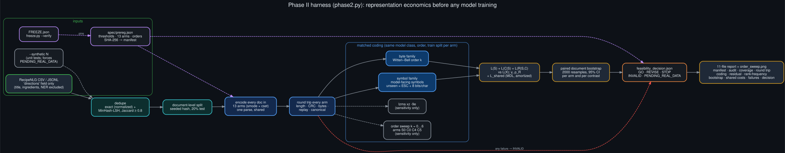

# H-SIR Phase II — codec and feasibility harness (protocol v0.3.3)

[](https://github.com/danindiana/h-sir/actions/workflows/tests.yml)


[](docs/diagrams/)

Reversible semantic-instruction codec for recipe text, plus the measurement
harness that decides whether H-SIR is worth training a transformer on.
**No model training happens here.** Training is permitted only after a
real-data report returns `GO`.

```
E(x) = (S, C, R)   S = semantic instruction stream (rule-based, versioned entities)
                   C = sparse categorical surface choices (separators, articles, ...)
                   R = byte-exact edit script from G(S, C) to x
D(E(x)) == x       for every byte string, verified by length + CRC + equality
```



## Setup (Ubuntu 24.04, bash/zsh)

```bash
cd h-sir
python3 -m venv .venv && source .venv/bin/activate
pip install -e '.[test,figures]'
pytest -q                      # 399 tests: round trips, modes, surface sets, residual, metrics, report, freeze
```

## Run Phase II

```bash
python experiments/freeze.py --verify            # v0.3.3 is frozen; must print "freeze intact"

# Real data: RecipeNLG CSV (only the `directions` column is read)
hsir-phase2 --input /path/to/RecipeNLG_dataset.csv --limit 50000 --out phase2/

# Synthetic smoke run (decision forced to PENDING_REAL_DATA)
hsir-phase2 --synthetic 2000 --out phase2_synth/

python experiments/entropy_report.py phase2/     # one-screen summary
python experiments/rank_frequency.py phase2/     # Zipf vs stretched-exp, H(concept|action)
```

Runtime is pure Python: roughly 50 s per 1,000 short recipes (13 arms × two
coding families × three orders, plus the order-0…6 sensitivity sweep on four
arms). Start with `--limit 20000`; the full 2.2 M-row corpus will
take hours and is not needed for a feasibility gate.

## Diagrams

Graphviz sources and renders live in [`docs/diagrams/`](docs/diagrams/)
(`bash docs/diagrams/render.sh` regenerates them).

| | |
|---|---|
| [Codec pipeline](docs/diagrams/01_codec_pipeline.svg) | [Container format v3](docs/diagrams/02_container_format_v3.svg) |
| [Entity state machine](docs/diagrams/03_entity_state_machine.svg) | [Serialization modes](docs/diagrams/04_serialization_modes.svg) |
| [Surface layer](docs/diagrams/05_surface_layer.svg) | [Phase II harness](docs/diagrams/06_phase2_harness.svg) |
| [Decision logic](docs/diagrams/07_decision_logic.svg) | [Research roadmap](docs/diagrams/08_research_roadmap.svg) |



Numbers shown in the serialization-mode and surface-layer diagrams come from
the synthetic example report and are labelled as such.

## Layout

```
spec/        semantic_isa.md, surface_schema.md, grammar.ebnf,
             codec_contract.md, prereg.json
src/hsir/    lexicon (frozen rules) · state (shared transition rules) · parser
             serial (S0/S1/S1a/S2k/S3 modes) · surface (C sets) · realizer
             residual · codec (format v3, decodes v2)
             metrics (WB byte/symbol models, rank fits, bootstrap)
             dataset (loader, dedupe, split) · control (length-matched BPE)
             phase2 (report writer + decision logic) · synthetic (tests only)
experiments/ corpus_generator.py, entropy_report.py, rank_frequency.py
examples/    phase2_synthetic/ — full 11-file report from 2,000 synthetic docs
docs/        diagrams/ — Graphviz .dot sources + .png/.svg renders
.github/     workflows/tests.yml — tests on 3.10/3.12/3.13, freeze check, diagram render
```

## Arms

An arm is a serialization mode × surface set, preregistered in
`spec/prereg.json`:

* modes: `S0` ascii/explicit · `S3` compact/explicit · `S1` compact/implicit ·
  `S1a` ascii/implicit · `S2k4/8/16` implicit with state checkpoints
* surface sets: `C0` none · `C1` separators, serial comma · `C2` + articles,
  case · `C3` + verb variants · `C4` + reference forms · `C4P` permuted-id control

Arms `C0`–`C6` follow the v0.3.3 plan (`C0` = S1 with byte patches only;
`C5` = S2k8 + C4; `C6` = S1 + C4P). See `spec/semantic_isa.md` and
`spec/surface_schema.md`.

## Methodological guards built in

| Constraint | Where |
|---|---|
| Real data only for the decision; synthetic → `PENDING_REAL_DATA` | `phase2.py` |
| Whole-corpus accounting, fallback included; covered subset reported separately | `phase2.py` |
| Matched coding families (byte and model-facing symbol), most-severe decision wins | `metrics.py`, `phase2.py` |
| `L_shared` = rule tables + compiler source, amortized | `shared_artifact_costs.json` |
| No privileged fields (title, ingredients, NER) | `dataset.py`, tested |
| Exact + MinHash near-dup removal before a document-level split | `dataset.py` |
| Rules frozen and hashed; changes logged | `RULES_CHANGELOG.md`, `manifest.json` |
| Thresholds preregistered and hashed | `spec/prereg.json` |

## Freeze and Phase III prediction

v0.3.3 is frozen: `FREEZE.json` pins the compiler sources, rule tables,
surface schema, preregistration and `spec/phase3_prediction.md` (the
capacity-substitution hypothesis, written before any real-data result).
`experiments/freeze.py --verify` must pass before the real-data run; any
re-freeze is logged in `RULES_CHANGELOG.md`. Analysis clarifications made
after the freeze live in `spec/phase3_clarifications.md`, outside the frozen
set, and change no hypothesis, arm or threshold.

## Before running on real data

1. Freeze `spec/prereg.json` (thresholds, seed, orders). Its hash goes in the manifest.
2. Develop rule changes on the **train** split only; then score test once.
3. State-tracking accuracy is reported as `UNMEASURED` until a gold-annotated
   sample exists (~200 recipes would do).
